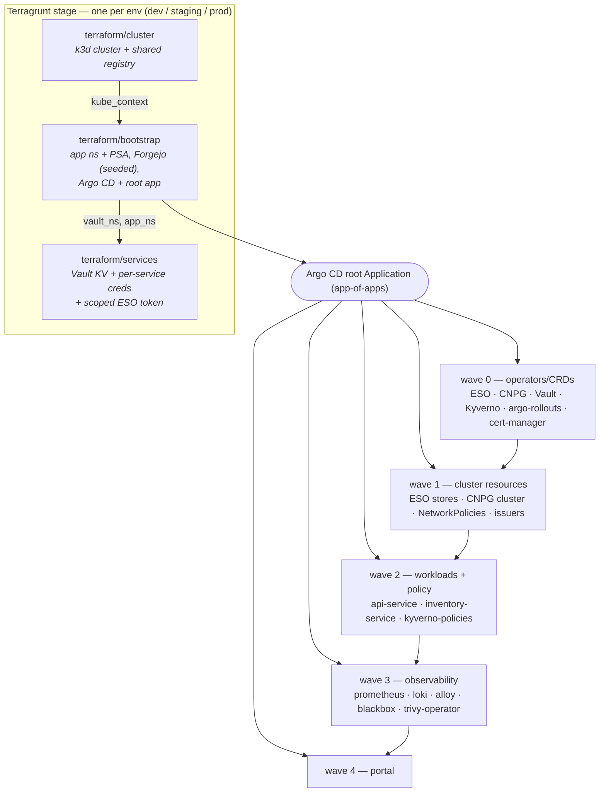

# Platform on k3d

**A production-shaped Kubernetes platform that comes up from scratch with a single command — no cloud account, no external Git host, no manual clicks.**


Two Rust microservices deployed across **three independent environments** (dev / staging / prod), each its own k3d cluster. Terraform + Terragrunt provision the clusters and install Argo CD; from there, **everything is GitOps** — Argo CD reads a bundled in-cluster Forgejo, so there's no dependency on a GitHub App or PAT. Rollouts are blue-green with automated promotion in dev/staging and a manual gate in prod. Secrets flow through Vault → External Secrets → Kubernetes with least-privilege scoping. A full Prometheus/Grafana/Loki stack and Kyverno/NetworkPolicy/Trivy security layer come up in the same reconcile.

---

## Highlights

- **One-command bring-up** — `./scripts/lazy.sh dev` goes from nothing to a fully reconciled cluster; `--tiny` fits ~8 GB of RAM, `all` runs all three envs side by side.
- **Real GitOps, self-contained** — Argo CD *app-of-apps* over a bundled Forgejo. CI never `kubectl apply`s; Argo CD is the only thing that touches the cluster.
- **Progressive delivery** — Argo Rollouts blue-green; dev/staging auto-promote, prod pauses at a manual gate. Rollback = revert the bump commit.
- **Secrets done right** — Vault (KV) → External Secrets Operator with a per-service, read-scoped token. No plaintext secrets in code or state.
- **Security baked in** — Kyverno policies (Audit in dev, Enforce in staging/prod), default-deny NetworkPolicies, Pod Security Admission, cert-manager local CA, and Trivy image/config scanning surfaced in Grafana.
- **Observability from the first sync** — kube-prometheus-stack, Loki, Alloy, blackbox probes, RED/USE dashboards, and SLO alerts.
- **Swappable substrate** — the `k3d-cluster` module can be replaced by an `eks`/`gke` module exposing the same outputs; bootstrap and services are unchanged.
- **CI/CD + tests** — Forgejo Actions pipelines (clippy, `cargo test`, Trivy, gitleaks, `tofu test`, helm-unittest, kubeconform), all mirrored by `scripts/test.sh` locally.

---

## Architecture

Terraform provisions the cluster and installs Argo CD; Argo CD deploys everything else from Git in ordered sync waves. Three composed layers, wired by Terragrunt `dependency`, over five reusable modules.



**Five detailed views** — provisioning, CI/CD (with per-env differences), observability, security, and the request/data path — render as Mermaid in **[docs/architecture.md](docs/architecture.md)**.

---

## Quickstart

Prereqs: Docker running, plus the pinned tools (`mise install` from `.tool-versions`, or `brew install k3d opentofu terragrunt kubectl helm jq`).

```bash
./scripts/lazy.sh dev        # nothing → cluster → bootstrap → services, fully reconciled
scripts/endpoints.sh dev     # every UI URL + credential, live from the cluster
scripts/creds.sh dev         # every username / password
```

Watch it converge: `kubectl --context k3d-platform-dev -n argocd get applications -w` (all → Synced/Healthy in ~2–4 min). Tear down: `./scripts/lazy-down.sh dev`.

Prefer no wrapper? `export TF_VAR_vault_token=root && terragrunt run-all apply --terragrunt-working-dir stages/dev`.

---

## Repository layout

| Path | What's there |
|---|---|
| `apps/` | The two Rust microservices (`api-service`, `inventory-service`) |
| `charts/microservice/` | One generic Helm chart both services deploy from |
| `terraform/` | TF roots (`cluster` / `bootstrap` / `services`) + reusable `modules/` |
| `stages/` | Terragrunt per-environment config (`dev` / `staging` / `prod`) |
| `gitops/bootstrap/` | Argo CD app-of-apps: what gets deployed, ordered in sync waves |
| `gitops/config/` | Per-service, per-env overlays (image tags, monitoring, portal) |
| `scripts/` | `lazy.sh`, `lazy-down.sh`, `endpoints.sh`, `creds.sh`, `demo-deploy.sh`, `test.sh` |
| `.forgejo/workflows/` | CI pipelines (apps + infra) and the pinned CI runner image |

## Documentation

| Doc | What's in it |
|---|---|
| [docs/architecture.md](docs/architecture.md) | Five Mermaid views: IaC, CI/CD per-env, observability, security, request path |
| [docs/RUNBOOK.md](docs/RUNBOOK.md) | Operating it: run steps, resource profiles, tests, observability, deploy safety & rollback, troubleshooting |
| [terraform/README.md](terraform/README.md) | Terraform module conventions and CI gates |

---

## License

[MIT](LICENSE).
