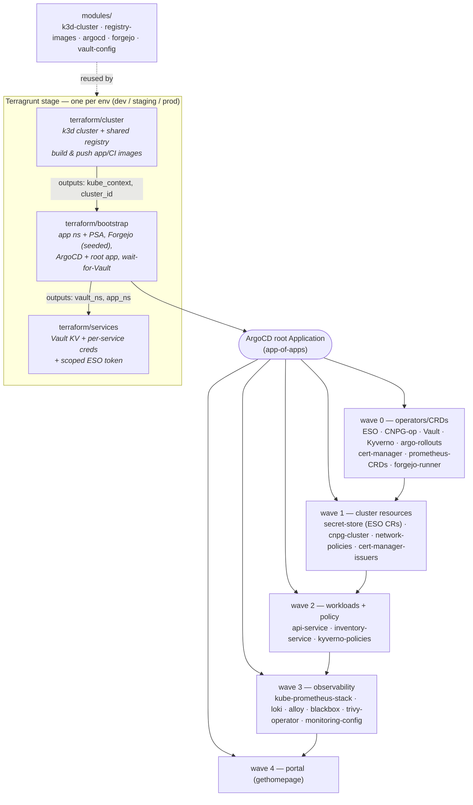
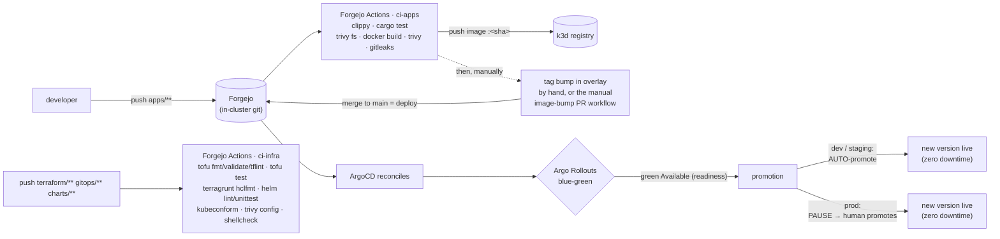
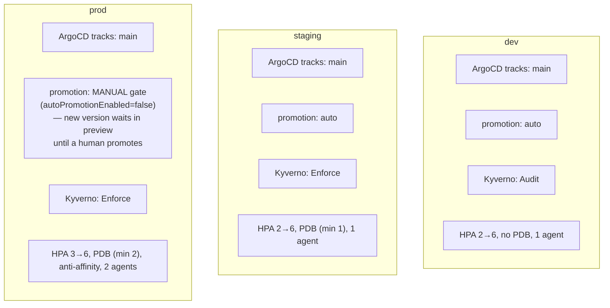
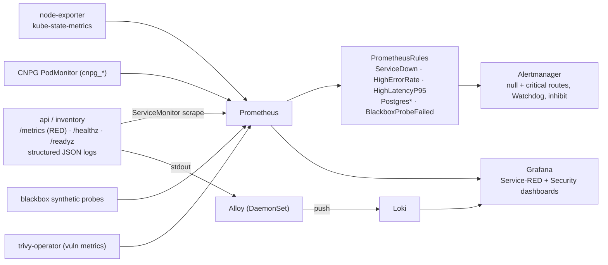
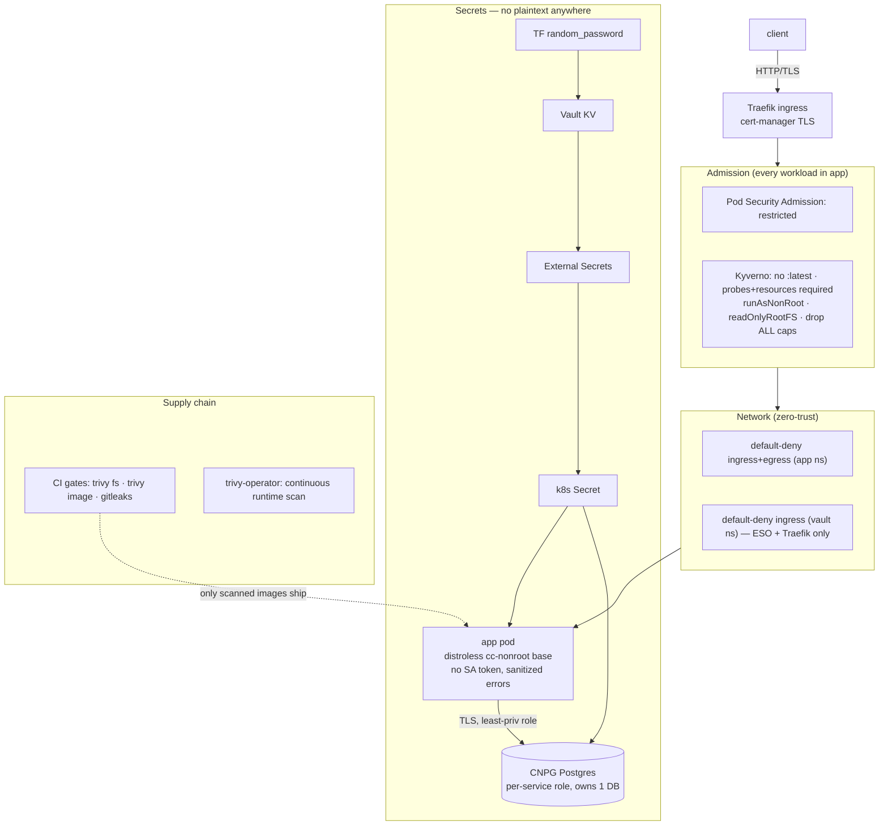
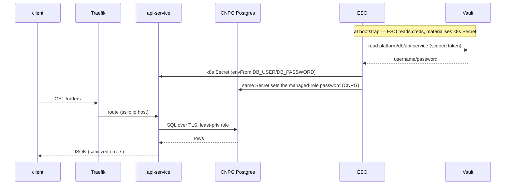

# Architecture diagrams

Rendered natively on GitHub/Forgejo (Mermaid). Five views: provisioning (IaC),
CI/CD (with per-environment differences), observability, security, and the
request/data path. Operations detail lives in [RUNBOOK.md](RUNBOOK.md).

---

## 1. Provisioning — IaC → GitOps (Terraform + Terragrunt + ArgoCD)

Terraform provisions the cluster and installs ArgoCD; ArgoCD deploys everything
else from git. Three composed layers, wired by Terragrunt `dependency` rather than
`terraform_remote_state`, over five reusable modules.

The cluster module is swappable: replace `k3d-cluster` with an `eks`/`gke`
module exposing the same outputs and bootstrap/services are unchanged.

---

## 2. CI/CD — build, publish, deploy (per environment)

Change → git → CI builds/scans/publishes the image → a tag bump on `main` (by hand,
or via the manual `image-bump` PR workflow) → ArgoCD → Argo Rollouts blue-green. CI
never `kubectl apply`s; ArgoCD is the only thing that touches the cluster.

Per-environment differences (same code, config-only):

Prod's safety is the manual promotion gate: a merged change syncs the manifests,
but the new version health-checks in preview and only takes traffic when a human
runs `kubectl argo rollouts promote`. `scripts/demo-deploy.sh <env>`
drives the whole loop live; `--break` proves a bad image never promotes.

---

## 3. Observability (RED + USE → Prometheus/Loki → Grafana/Alertmanager)

Alertmanager routes to a `null` receiver in the sandbox; the `critical` route is
wired to Slack/PagerDuty from a Secret in prod (shown, not enabled).

---

## 4. Security — defense in depth

Scope is honest: default-deny + PSA + Kyverno cover the app namespace (and the
vault namespace for network); other platform namespaces run upstream charts and
are left open in the sandbox. Roadmap: cosign/verifyImages, Falco, DefectDojo,
cluster-wide default-deny.

---

## 5. Request & secret path (runtime)

